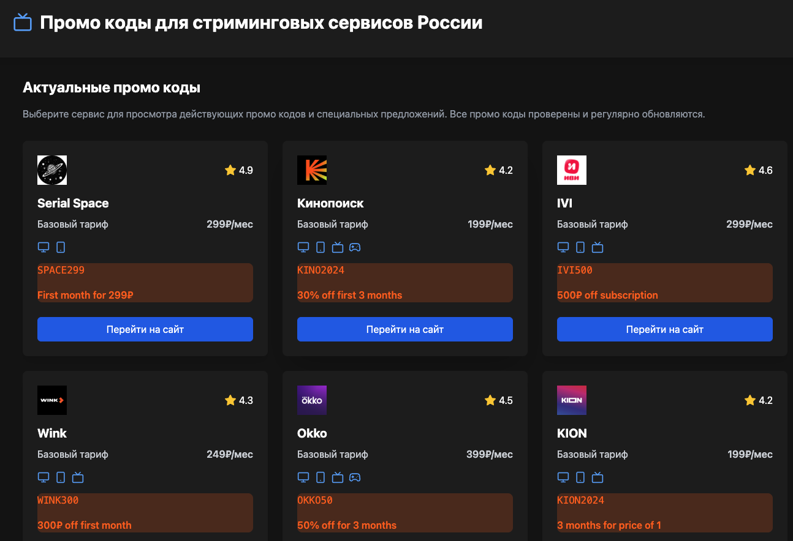
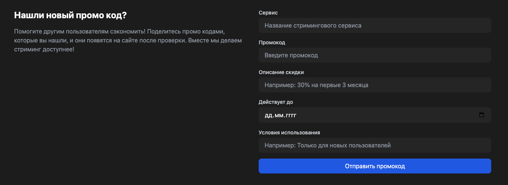

# Каталог российских стриминговых сервисов

Агрегатор информации и каталог российских стриминговых сервисов. Проект помогает пользователям сравнивать различные стриминговые платформы, находить актуальные промокоды и выбирать оптимальный сервис для своих потребностей.

GIT https://github.com/valdipelh/Promo.git



## 🚀 Возможности

- 📱 Подробная информация о 11 популярных стриминговых сервисах
- 💰 Актуальные цены и тарифные планы
- 🎁 Действующие промокоды со скидками
- 📺 Информация о поддерживаемых устройствах
- 🎬 Каталог эксклюзивного контента
- 🌟 Рейтинги и сравнение сервисов
- 📥 Возможность отправки новых промокодов от пользователей

## 💻 Технологии

- [Astro](https://astro.build/) - Современный фреймворк для создания быстрых веб-сайтов
- [React](https://reactjs.org/) - Библиотека для создания пользовательских интерфейсов
- [Tailwind CSS](https://tailwindcss.com/) - Утилитарный CSS-фреймворк
- [Lucide Icons](https://lucide.dev/) - Красивые иконки с открытым исходным кодом

## 🛠 Установка и запуск

1. Клонируйте репозиторий:
```bash
git clone https://github.com/valdipelh/Promo.git
```

2. Установите зависимости:
```bash
npm install
```

3. Запустите сервер разработки:
```bash
npm run dev
```

4. Откройте [http://localhost:4321](http://localhost:4321) в браузере

## 📦 Сборка

Для создания production-сборки:

```bash
npm run build
```

Собранные файлы будут находиться в директории `dist/`.

## 🌟 Особенности реализации

### Архитектура проекта

- `src/components/` - React и Astro компоненты
- `src/data/` - JSON файлы с данными сервисов
- `src/layouts/` - Шаблоны страниц
- `src/pages/` - Маршрутизация и страницы
- `src/types/` - TypeScript типы и интерфейсы

### Основные компоненты

- `ServiceCard` - Карточка стримингового сервиса
- `PromoCodeBlock` - Блок с промокодом
- `PromoSubmissionForm` - Форма отправки новых промокодов
- `Footer` - Подвал с формой обратной связи

## 📱 Поддерживаемые платформы

Для каждого сервиса отображается информация о поддержке:

- 🖥 Веб-браузеров
- 📱 Мобильных устройств
- 📺 Smart TV
- 🎮 Игровых консолей

## 🔄 Обновление данных

Информация о сервисах хранится в JSON файлах в директории `src/data/services/`. Каждый сервис описывается следующими параметрами:

- Основная информация (название, рейтинг, URL)
- Тарифные планы и цены
- Поддерживаемые платформы
- Качество контента
- Доступные функции
- Промокоды

## 🤝 Участие в разработке

Мы приветствуем вклад в проект! Вы можете:

1. Добавлять новые промокоды через форму на сайте
2. Сообщать об устаревшей информации
3. Предлагать новые функции
4. Исправлять ошибки

## 📄 Лицензия

MIT License - используйте код в своих проектах.

## 📞 Контакты

По всем вопросам используйте форму на сайте или создайте issue в репозитории проекта.